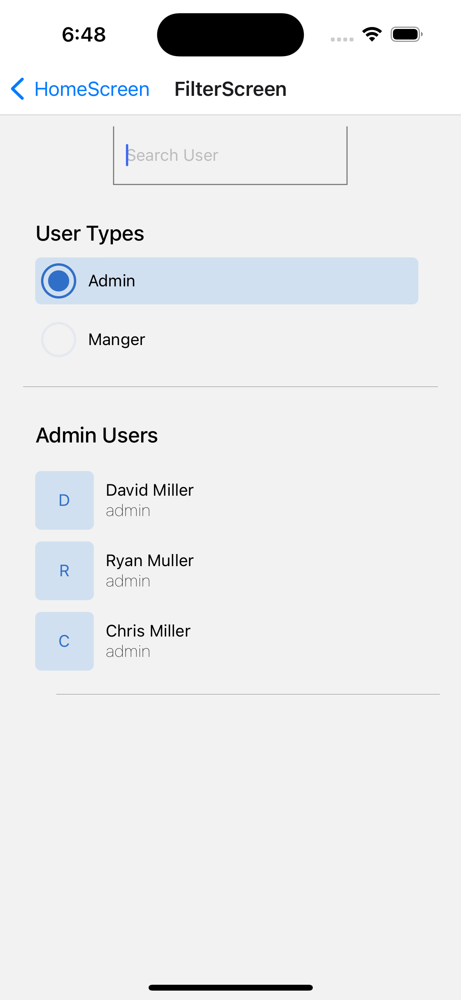
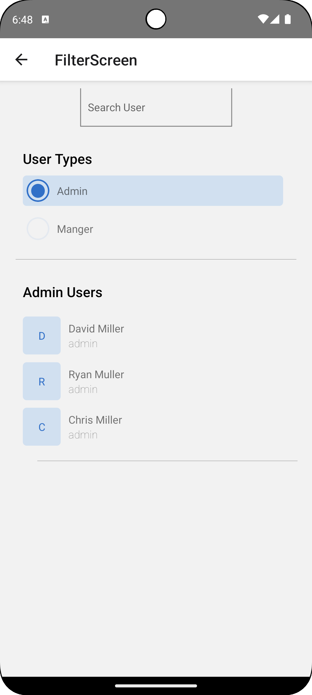

# Introducation

I'm Lalit kumat. I have 9+ years of exprience in mobile application development. Here i'm preseting my zeller (https://www.myzeller.com/) react-native application demo. As per the requirement this application working in both android and iOS. I cover the bonus point also in this demo part. 

Please review it

## Demo app videos

I’m presenting demo videos showcasing the application’s functionality on both Android and iOS.

| IOS Video  | Android Video |
|--------------|-------------|
| |  
| |

## Cover bonus points

I have covered the bonus point in this demo part. The bonus point is to add a feature to
- Add multiple page in application to show the navigation part.
- Add pull to refresh feature.
- Add Search functionality to search user by their name. 

# Conclusion 

Thank you for reviewing my project. I hope the demo videos and images provide a clear understanding of the application’s capabilities on both Android and iOS. I welcome any feedback or suggestions!